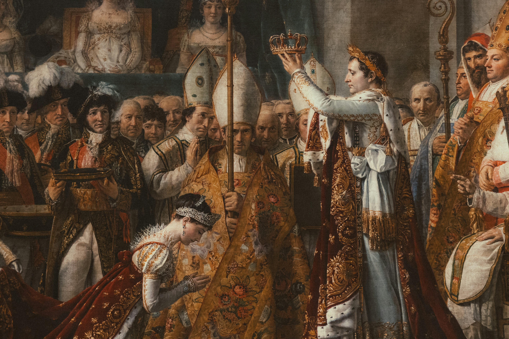

[Michael McKay on Unsplash](https://unsplash.com/photos/napoleon-crowns-himself-emperor-and-josephine-YiGvXVwrsVU)

# Napoleon-Complex-Skills
A Claude Code agent framework inspired by Napoleon Bonaparte’s marshal system. Organizes AI agents into specialized roles for strategy, execution, quality, operations, and coordination, enabling complex software and business projects to be managed through structured delegation, command doctrine, and clear chains of responsibility.

The main purpose of this repository is to continue evolving CEO thinking and methodology, making it faster and more efficient at scale.

# Installation and Usage
I vibe-coded it somewhere between my third coffee, a mild existential crisis, and an unhealthy amount of reading about Napoleonic military campaigns. I don't have time for documentation.

# Code of Conduct
We have adopted the [Code civil des Français](https://www.legifrance.gouv.fr/codes/texte_lc/LEGITEXT000006070721/1804-03-25) and we expect project participants to adhere to it. Please read the full text so that you can understand what actions will and will not be tolerated.

# License
This project is licensed under the Creative Commons Attribution 4.0 International (CC BY 4.0) License.

You are free to share, copy, redistribute, remix, transform, and build upon this material for any purpose, including commercial use, provided appropriate attribution is given.

For full license details, see: https://creativecommons.org/licenses/by/4.0/
